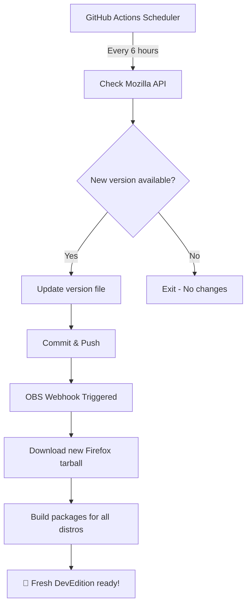

# 🦊 Firefox Developer Edition – OBS Auto-Builder

[](https://github.com/itachi-re/ff-dev-obs/actions)
[](https://build.opensuse.org/package/show/home:itachi_re/ff-dev-edition)
[](LICENSE)

**Automated version tracking & packaging for Firefox Developer Edition on openSUSE Build Service**

*Zero-maintenance automation that keeps your DevEdition packages always up-to-date with Mozilla's latest releases.*

---

## 🎯 Overview

This repository serves as an automated version source for building Firefox Developer Edition packages on the Open Build Service (OBS). It continuously monitors Mozilla's release channels and triggers rebuilds whenever a new DevEdition version is published.

### ✨ Key Features

- 🤖 **Fully Automated** – Checks for updates every 6 hours using GitHub Actions
- 🔄 **Instant Updates** – Automatically commits new versions and triggers OBS rebuilds
- 🎯 **Single Source of Truth** – Centralized version management for your OBS package
- 🚀 **Zero Maintenance** – Set it up once, forget about it
- 📦 **OBS Native** – Seamlessly integrates with openSUSE Build Service workflows

---

## 🔄 How It Works



### 📡 Version Detection

The system queries Mozilla's official Product Details API:
```
https://product-details.mozilla.org/1.0/firefox_versions.json
```

It extracts the `FIREFOX_DEVEDITION` field, which provides the current Developer Edition version (e.g., `146.0b5`).

---

## 📦 Repository Structure

```
ff-dev-obs/
├── version                          # Current DevEdition version (updated automatically)
├── .github/workflows/
│   └── update-version.yml          # GitHub Action for version checking
├── README.md                        # This file
├── LICENSE                          # MIT License
└── .gitignore                       # Git ignore rules
```

### 📄 Key Files

| File | Purpose | Updated By |
|------|---------|------------|
| `version` | Stores the current Firefox DevEdition version | GitHub Actions (automated) |
| `.github/workflows/update-version.yml` | Defines the update automation workflow | Manual edits only |
| `README.md` | Documentation for users and contributors | Manual edits only |

---

## 🛠️ OBS Integration Guide

### Setting Up Your OBS Package

To use this automated version source in your OBS package, add the following `_service` file:

```xml
<services>
  <!-- Fetch version from GitHub repository -->
  <service name="obs_scm">
    <param name="scm">git</param>
    <param name="url">https://github.com/itachi-re/ff-dev-obs.git</param>
    <param name="revision">main</param>
    <param name="extract">version</param>
  </service>

  <!-- Download Firefox Developer Edition source tarball -->
  <service name="download_url">
    <param name="url">https://ftp.mozilla.org/pub/devedition/releases/@@VERSION@@/source/firefox-@@VERSION@@.source.tar.xz</param>
    <param name="filename">firefox-devedition.tar.xz</param>
  </service>

  <!-- Extract source files -->
  <service name="extract_file">
    <param name="archive">firefox-devedition.tar.xz</param>
    <param name="files">*</param>
  </service>

  <!-- Automatically set package version -->
  <service name="set_version">
    <param name="basename">ff-dev-edition</param>
  </service>
</services>
```

### 🔗 Live OBS Package

The reference implementation is available at:  
**[home:itachi_re/ff-dev-edition](https://build.opensuse.org/package/show/home:itachi_re/ff-dev-edition)**

---

## 🚀 Quick Start

### For Package Maintainers

1. **Fork this repository** (optional, if you want your own version tracker)
2. **Configure your OBS package** using the `_service` file above
3. **Enable OBS webhooks** to trigger rebuilds on commit
4. **Relax** – Updates happen automatically!

### Manual Trigger

Need an immediate update check? You can manually trigger the workflow:

1. Navigate to the **[Actions](https://github.com/itachi-re/ff-dev-obs/actions)** tab
2. Select **"Update Firefox DevEdition Version"** workflow
3. Click **"Run workflow"** → **"Run workflow"** button

The workflow will execute immediately and update the version if a new release is available.

---

## ⚙️ Configuration

### Customizing Update Frequency

The default check interval is every 6 hours. To modify this, edit `.github/workflows/update-version.yml`:

```yaml
on:
  schedule:
    - cron: '0 */6 * * *'  # Change this line
  workflow_dispatch:
```

**Cron format guide:**
- `0 */6 * * *` – Every 6 hours
- `0 */2 * * *` – Every 2 hours  
- `0 0 * * *` – Daily at midnight
- `0 0 * * 0` – Weekly on Sundays

---

## 🐛 Troubleshooting

### Common Issues

**Problem:** OBS package not updating automatically  
**Solution:** Ensure OBS webhooks are enabled. Go to your OBS package → **Advanced** → **Webhooks** and verify GitHub integration.

**Problem:** Workflow fails with API errors  
**Solution:** Mozilla's API might be temporarily unavailable. The next scheduled run will retry automatically.

**Problem:** Version file exists but OBS shows old version  
**Solution:** Manually trigger an OBS rebuild or check your `_service` file configuration.

### Debugging

Check workflow execution logs:
1. Go to **[Actions](https://github.com/itachi-re/ff-dev-obs/actions)** tab
2. Click on the latest workflow run
3. Expand **"Check for new version"** step

---

## 🤝 Contributing

Contributions are welcome! Here's how you can help:

- 🐛 **Report bugs** – Open an issue if something isn't working
- 💡 **Suggest features** – Have an idea? We'd love to hear it
- 🔧 **Submit PRs** – Improvements to automation or documentation
- 📖 **Improve docs** – Help make this README even better

### Development Workflow

```bash
# Clone the repository
git clone https://github.com/itachi-re/ff-dev-obs.git
cd ff-dev-obs

# Make your changes
# Test locally if possible

# Commit and push
git add .
git commit -m "Your descriptive commit message"
git push origin main
```

---

## 📊 Status & Monitoring

### Current Version
Check the latest tracked version: [`version` file](version)

### Build Status
Monitor the OBS build status for all supported distributions at:  
[OBS Build Results](https://build.opensuse.org/package/show/home:itachi_re/ff-dev-edition)

### Workflow History
View all automation runs in the **[Actions](https://github.com/itachi-re/ff-dev-obs/actions)** tab.

---

## 📞 Support & Contact

**Maintainer:** [itachi_re](https://github.com/itachi-re)  
**Email:** xanbenson99@gmail.com  
**OBS Profile:** [home:itachi_re](https://build.opensuse.org/users/itachi_re)

**Found a bug?** [Open an issue](https://github.com/itachi-re/ff-dev-obs/issues/new)  
**Have a question?** Start a [discussion](https://github.com/itachi-re/ff-dev-obs/discussions)

---

## 📜 License

This project is licensed under the **MIT License** – see the [LICENSE](LICENSE) file for details.

---

## 🙏 Acknowledgments

- **Mozilla Firefox** – For making Firefox Developer Edition available
- **openSUSE Build Service** – For providing excellent build infrastructure
- **GitHub Actions** – For free automation hosting

---

## 🔗 Related Resources

- [Firefox Developer Edition Download](https://www.mozilla.org/firefox/developer/)
- [openSUSE Build Service Documentation](https://openbuildservice.org/help/manuals/obs-user-guide/)
- [Mozilla Product Details API](https://product-details.mozilla.org/)
- [GitHub Actions Documentation](https://docs.github.com/en/actions)

---

<div align="center">

**⚡ Zero maintenance. Fully automated. Always up-to-date.**

*Made with 🦊 by the openSUSE community*

[](https://github.com/itachi-re/ff-dev-obs)

</div>
