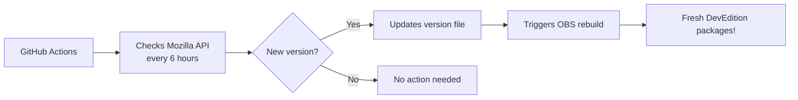

# 🔥 Firefox Developer Edition – OBS Auto-Builder

**Automated version tracking & packaging for Firefox Developer Edition**  
*Never miss a DevEdition update again!*

---

## 📦 What This Does

This repository automatically tracks Mozilla's Firefox Developer Edition releases and provides a clean version source for Open Build Service (OBS) packaging.

### 🚀 Automated Workflow


---

## 🛠 Files in This Repository

| File | Purpose |
|------|---------|
| `version` | Current DevEdition version (e.g., `146.0b5`) |
| `.github/workflows/update-version.yml` | Auto-update GitHub Action |
| `README.md` | This documentation |
| `.gitignore` | Ignore temp files |

---

## 📥 OBS Integration

Use this `_service` file in your OBS package:

```xml
<services>
  <!-- Pull version from this GitHub repo -->
  <service name="obs_scm">
    <param name="scm">git</param>
    <param name="url">https://github.com/itachi-re/ff-dev-obs.git</param>
    <param name="revision">main</param>
    <param name="extract">version</param>
  </service>

  <!-- Download Firefox source tarball -->
  <service name="download_url">
    <param name="url">https://ftp.mozilla.org/pub/devedition/releases/$VERSION/source/firefox-$VERSION.source.tar.xz</param>
    <param name="filename">firefox-devedition.tar.xz</param>
  </service>

  <service name="extract_file">
    <param name="archive">firefox-devedition.tar.xz</param>
  </service>

  <service name="set_version"/>
</services>
```

---

## 🔧 Manual Trigger

Need an immediate update? Go to:
1. **Actions** tab in this repo
2. **"Update Firefox DevEdition Version"** workflow  
3. Click **"Run workflow"**

---

## 📊 Version Sources

The automation checks Mozilla's official API:
```
https://product-details.mozilla.org/1.0/firefox_versions.json
```

Extracts: `FIREFOX_DEVEDITION`

---

## 🐛 Issues & Support

**Repository**: [itachi-re/ff-dev-obs](https://github.com/itachi-re/ff-dev-obs)  
**Maintainer**: [itachi_re](mailto:xanbenson99@gmail.com)

Found a problem? Open an issue or contact the maintainer!

---

## 📜 License

This project is open source under the MIT License.

---

**⚡ Zero maintenance. Completely automated. Always up-to-date.**
